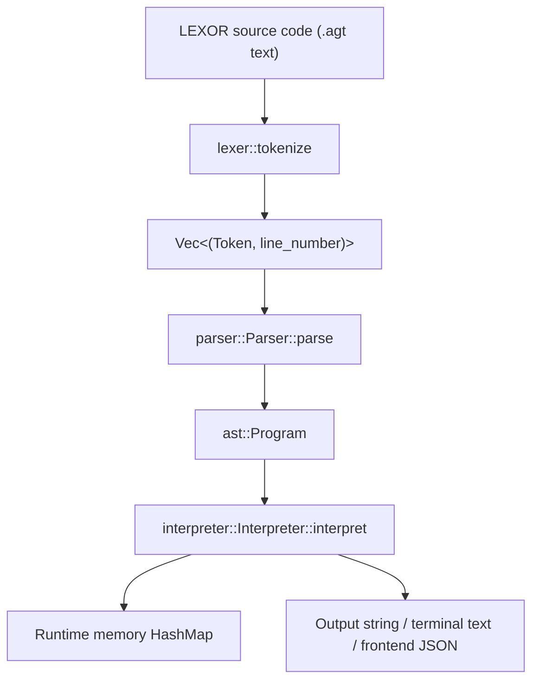

# LEXOR Interpreter Pipeline

This document maps the Rust interpreter in `LEXOR/src` as it currently works.
It focuses on the implemented pipeline rather than only the language
specification.

## Project Shape

`LEXOR` is a Rust crate named `Agartha`. It builds both:

- a native binary, entered through `src/main.rs`
- a library/WASM surface, entered through `src/lib.rs`

The core interpreter pipeline is shared by both surfaces:



## Entrypoints

### Native CLI: `src/main.rs`

`main.rs` decides how the interpreter starts:

1. It reads command-line arguments with `std::env::args`.
2. If a file argument is present, it requires the file name to end with `.agt`.
3. If the argument is only a file name, it routes it into `scripts/<file>`.
4. It calls `simulate::run_file(&filepath)`.
5. If no argument is passed, it calls `test::run_test()`.

CLI examples from inside `LEXOR`:

```powershell
cargo run -- scripts/controltest.agt
cargo run -- controltest.agt
cargo run
```

The no-argument mode is a small collector REPL: it reads source lines until the
user types `exit`, then runs the whole collected program once.

### File Runner: `src/simulate.rs`

`simulate::run_file` handles native file execution:

1. Read the `.agt` file into a `String`.
2. Print an execution header.
3. Run `lexer::tokenize`.
4. Create `parser::Parser::new(tokens)`.
5. Run `parser.parse()`.
6. Create `interpreter::Interpreter::new("")`.
7. Run `interpret(program)`.
8. Print the interpreter output string.

Syntax and lexer errors are printed directly. Runtime errors are appended to the
interpreter output by `Interpreter::interpret`.

### Frontend/WASM: `src/lib.rs`

`lib.rs` exposes:

```rust
#[wasm_bindgen]
pub fn run_agartha_code(source_code: &str, scan_inputs: &str) -> String
```

This is the frontend-facing version of the same pipeline:

1. Tokenize `source_code`.
2. Parse tokens into a `Program`.
3. Create `Interpreter::new(scan_inputs)`.
4. Interpret the program.
5. Return a JSON string.

The returned JSON status is one of:

- `{"status":"error","output":"..."}` for lexer/parser errors
- `{"status":"scan_wait","output":"...","count":N}` when execution reaches
  `SCAN` and no input line is available
- `{"status":"done","output":"..."}` when execution completes

`json_escape` manually escapes output text before embedding it in the JSON
string.

## Stage 1: Tokenization

Implemented in `src/lexer.rs`.

Main function:

```rust
pub fn tokenize(input: &str) -> Result<Vec<(Token, usize)>, String>
```

The lexer converts raw source text into `(Token, line_number)` pairs. The line
number is carried into the parser so errors can report source lines.

### What the Lexer Recognizes

Program structure:

- `SCRIPT AREA`
- `START SCRIPT`
- `END SCRIPT`

Declarations and types:

- `DECLARE`
- `INT`
- `FLOAT`
- `CHAR`
- `STRING`
- `BOOL`

Control flow:

- `IF`
- `ELSE`
- `ELSE IF`
- `START IF`
- `END IF`
- `FOR`
- `START FOR`
- `END FOR`
- `REPEAT WHEN`
- `START REPEAT`
- `END REPEAT`

I/O:

- `PRINT`
- `SCAN`

Literals:

- integer literals into `Token::IntLiteral(i32)`
- float literals into `Token::FloatLiteral(f64)`
- character literals like `'A'` into `Token::CharLiteral(char)`
- quoted strings into `Token::StringLiteral(String)`
- `"TRUE"` and `"FALSE"` into `Token::BoolLiteral(bool)`
- bracket escape content like `[#]` into `Token::StringLiteral("#")`
- `$` into `Token::Dollar`

Operators:

- assignment: `=`
- increment/decrement: `++`, `--`
- equality: `==`
- not equal: `<>`
- comparison: `<`, `>`, `<=`, `>=`
- arithmetic: `+`, `-`, `*`, `/`, `%`, `^`
- logical: `AND`, `OR`, `NOT`
- concatenation: `&`
- separators: `,`, `:`, `(`, `)`

Comments:

- `%%` skips the rest of the current line.

### Lexer Notes

- Newlines are not emitted as tokens. They are tracked only through the line
  number attached to each token.
- `[` and `]` are not emitted as `LeftBracket` and `RightBracket` in the current
  lexer. Bracketed content is converted directly into a string literal.
- `^` is tokenized as `Exponentiate`, but parsing/evaluation for exponentiation
  is not currently implemented.

## Stage 2: Token Definitions

Implemented in `src/token.rs`.

`Token` is the shared vocabulary between the lexer, parser, and interpreter.
It contains:

- structural tokens
- declaration/type tokens
- control-flow tokens
- I/O tokens
- literal tokens
- operator tokens
- delimiter tokens

Because the parser compares token kinds with `std::mem::discriminant`, most
checks care about the token variant, not the payload. For example,
`Identifier("x")` and `Identifier("y")` match the same token kind when checking
whether the current token is an identifier.

## Stage 3: AST Shape

Implemented in `src/ast.rs`.

The parser produces a `Program`:

```rust
pub struct Program {
    pub statements: Vec<Statement>,
}
```

### Expressions

`Expression` represents values or computations:

- `IntType(i32)`
- `FloatType(f64)`
- `StringType(String)`
- `CharType(char)`
- `BoolType(bool)`
- `Identifier(String)`
- `BinaryOp { left, operator, right }`
- `UnaryOp { operator, right }`

### Statements

`Statement` represents executable language constructs:

- `Declaration { var_type, declarations }`
- `Assignment { targets, value }`
- `Increment { name, is_increment }`
- `Print(Expression)`
- `Scan(Vec<String>)`
- `If { condition, body, else_ifs, else_body }`
- `For { initialization, condition, update, body }`
- `Repeat { condition, body }`

The AST is directly interpreted. There is no bytecode, IR, or separate code
generation stage.

## Stage 4: Parsing

Implemented in `src/parser.rs`.

The parser is a recursive-descent parser with operator-precedence methods for
expressions.

### Parser State

`Parser` stores:

- `tokens`: the token stream
- `current`: the current token index
- `seen_executable`: whether a non-declaration statement has appeared
- `last_parsed_line`: used to enforce one statement per line

### Top-Level Program Rule

`Parser::parse` enforces this outer shape:

```text
SCRIPT AREA
START SCRIPT
<statements>
END SCRIPT
```

It rejects:

- empty files
- missing `SCRIPT AREA`
- missing `START SCRIPT`
- missing `END SCRIPT`
- duplicate `END SCRIPT`
- any code after `END SCRIPT`

### Statement Routing

`parse_statement` chooses the statement parser based on the current token:

- `DECLARE` -> `parse_declaration`
- `PRINT` -> `parse_print`
- `SCAN` -> `parse_scan`
- `IF` -> `parse_if`
- `FOR` -> `parse_for`
- `REPEAT WHEN` -> `parse_repeat`
- otherwise -> `parse_assignment`

Declarations are only allowed before executable statements. Once the parser
sees a print, scan, assignment, if, for, or repeat statement, future
declarations become a syntax error.

### One Statement Per Line

`step_statement` wraps `parse_statement` and compares the starting line of the
new statement with the previous statement's ending line. If both are on the
same line, parsing fails with:

```text
Multiple statements on the same line are not allowed.
```

The parser intentionally allows multiple sub-parts inside a `FOR (...)` header
on one line because those are part of the loop header, not separate source
statements.

### Declarations

Current declaration syntax:

```text
DECLARE <type> name [, name ...]
DECLARE <type> name = <expression> [, name = <expression> ...]
```

The parser currently accepts only:

- `INT`
- `FLOAT`
- `CHAR`
- `BOOL`

Although the lexer has `STRING`, `parse_declaration` does not include
`Token::StringType` in its allowed type list.

### Assignments

Assignments support chained targets:

```text
x = 1
x = y = 20
```

The parser stores this as:

```rust
Statement::Assignment {
    targets: vec!["x", "y"],
    value: Expression::IntType(20),
}
```

At runtime, the right-hand expression is evaluated once, then coerced and
assigned into each target.

### Increment and Decrement

Postfix increment and decrement are standalone statements:

```text
x++
x--
```

The parser stores both forms as `Statement::Increment`, using `is_increment` to
distinguish `++` from `--`. These statements are also accepted anywhere the
parser currently calls `parse_assignment`, including the update slot of a
`FOR (...)` header.

### Print

Print syntax:

```text
PRINT: <expression>
```

String concatenation is represented with the `&` operator, which is parsed as a
binary expression using `Token::Concat`.

### Scan

Scan syntax:

```text
SCAN: x
SCAN: x, y
```

The parser stores the target variable names and leaves input handling to the
interpreter.

### If / Else If / Else

Implemented shape:

```text
IF (<bool expression>)
START IF
    <statements>
END IF
ELSE IF (<bool expression>)
START IF
    <statements>
END IF
ELSE
START IF
    <statements>
END IF
```

The AST stores:

- first condition and body
- zero or more `(condition, body)` `else_ifs`
- optional `else_body`

Nested `IF` blocks are supported because block bodies parse statements
recursively.

### For

Implemented shape:

```text
FOR (initialization, condition, update)
START FOR
    <statements>
END FOR
```

The initialization and update pieces are parsed as assignments. The condition is
parsed as an expression and must evaluate to `BOOL` at runtime.

### Repeat When

Implemented shape:

```text
REPEAT WHEN (<bool expression>)
START REPEAT
    <statements>
END REPEAT
```

This behaves like a while loop: the condition is evaluated before each
iteration.

### Expression Precedence

The parser uses this precedence order, from lowest to highest:

1. `OR`
2. `AND`
3. equality: `==`, `<>`
4. comparison: `<`, `>`, `<=`, `>=`
5. term: `+`, `-`, `&`
6. factor: `*`, `/`, `%`
7. unary: `+`, `-`, `NOT`
8. primary: literals, identifiers, `$`, parenthesized expressions

Parentheses create grouped expressions.

## Stage 5: Interpretation

Implemented in `src/interpreter.rs`.

The interpreter is a tree-walk runtime. It walks the AST and directly executes
each `Statement`.

### Runtime State

`Interpreter` stores:

- `memory: HashMap<String, RuntimeVariable>`
- `output: String`
- `scan_inputs: Vec<String>`
- `scan_cursor: usize`
- `needs_input: bool`
- `scan_target_count: usize`

Each runtime variable stores:

```rust
struct RuntimeVariable {
    declared_type: Token,
    value: Expression,
}
```

This means the runtime keeps both the declared type and the current value for
each variable.

### Program Execution

`Interpreter::interpret(program)`:

1. Resets `needs_input` and `scan_target_count`.
2. Executes statements in order.
3. Stops if a statement returns an error.
4. Treats the special internal error string `__SCAN_WAIT__` as a frontend input
   pause.
5. Appends other runtime errors to `output` as `Runtime Error: ...`.

### Declaration Execution

For each declared variable:

1. Reject duplicate variable names.
2. If an initializer exists, evaluate it.
3. Coerce the evaluated value into the declared type.
4. If no initializer exists, create a default value.
5. Insert the variable into `memory`.

Default values:

- `INT` -> `0`
- `FLOAT` -> `0.0`
- `CHAR` -> space character
- `BOOL` -> `FALSE`

### Assignment Execution

For assignments:

1. Evaluate the right-hand expression once.
2. For each target name:
   - ensure the variable was declared
   - fetch its declared type
   - coerce the evaluated value into that type
   - update the stored runtime value

Supported coercion:

- `INT` accepts only integer values.
- `FLOAT` accepts float values and integer values.
- `CHAR` accepts only character values.
- `BOOL` accepts only boolean values.

The runtime gives special errors for lowercase or string-like boolean mistakes,
for example using `"true"` instead of `"TRUE"`.

For increment/decrement:

1. Look up the target variable.
2. Require its stored value to be `INT` or `FLOAT`.
3. Add or subtract `1` for `INT`.
4. Add or subtract `1.0` for `FLOAT`.
5. Reject `CHAR`, `BOOL`, and string values with a runtime type error.

### Scan Execution

`SCAN` reads from pre-supplied input lines in `Interpreter::new(scan_inputs)`.
Input lines are split by newline first, then each `SCAN` consumes one line.

For a statement like:

```text
SCAN: x, y
```

the consumed input line must look like:

```text
10, 20
```

Execution steps:

1. If no input line is available, set `scan_target_count` and return
   `__SCAN_WAIT__`.
2. Echo the consumed input line to `output`.
3. Split the line by commas.
4. Ensure the number of comma-separated values matches the number of targets.
5. Parse each input into the target variable's declared type.
6. Store the parsed values in memory.

Supported scanned types:

- `INT`
- `FLOAT`
- `CHAR`
- `BOOL`

### Print Execution

`PRINT` evaluates its expression and appends the display text to
`Interpreter::output`.

`value_to_output` formats values like this:

- `INT` -> decimal text
- `FLOAT` -> decimal text
- `STRING` -> raw string
- `BOOL` -> `TRUE` or `FALSE`
- `CHAR` -> character text

The `$` token is parsed as `"\n"`, so it produces a newline when printed or
concatenated.

### If Execution

For `IF`:

1. Evaluate the first condition.
2. Require it to be `BOOL`.
3. If true, execute the first body and skip alternatives.
4. Otherwise, evaluate `ELSE IF` conditions in order.
5. Execute the first true `ELSE IF` body.
6. If no branch ran, execute `ELSE` if present.

### Loop Execution

For `FOR`:

1. Execute initialization assignment.
2. Evaluate condition.
3. Require condition to be `BOOL`.
4. If false, exit.
5. Execute body statements.
6. Execute update assignment.
7. Repeat from condition evaluation.

For `REPEAT WHEN`:

1. Evaluate condition.
2. Require condition to be `BOOL`.
3. If false, exit.
4. Execute body statements.
5. Repeat from condition evaluation.

There is no loop iteration limit or timeout guard in the interpreter, so an
always-true condition can run forever.

## Expression Evaluation

`evaluate_expression` recursively evaluates the AST expression tree.

### Literals and Identifiers

Literal expressions return themselves.

Identifiers are looked up in runtime `memory`. Missing identifiers produce a
runtime error.

### Unary Operators

Implemented unary operators:

- `-` for `INT` and `FLOAT`
- `+` for `INT` and `FLOAT`
- `NOT` for `BOOL`

### Binary Operators

Implemented binary operators:

- `&`: converts both sides to output text and concatenates them
- `+`, `-`, `*`: numeric operations on `INT` or `FLOAT`
- `/`: integer division for two `INT` values, float division otherwise
- `%`: modulo for two `INT` values only
- `<`, `>`, `<=`, `>=`: numeric comparison
- `==`, `<>`: equality/inequality for compatible types
- `AND`, `OR`: boolean operations

Mixed `INT` and `FLOAT` arithmetic promotes to `FLOAT`.

Division by zero and modulo by zero return runtime errors.

## Error Flow

The pipeline has three main error layers:

1. Lexer errors: returned by `lexer::tokenize`.
2. Parser errors: returned by `Parser::parse`.
3. Runtime errors: returned from statement/expression execution and appended to
   interpreter output.

The unused `src/errors.rs` file currently contains only a placeholder comment.

## Current Gaps and Mismatches

These are visible from the Rust code and sample scripts:

- `STRING` is tokenized and sample scripts use `DECLARE STRING`, but the parser
  rejects `STRING` declarations.
- `Token::StringType` exists, and string literals work in expressions, but
  declared string variables are not fully wired through declarations/defaults.
- `^` is tokenized as `Exponentiate`, but the parser and interpreter do not
  implement exponentiation.
- `Token::LeftBracket` and `Token::RightBracket` exist, and the parser has a
  primary-expression branch for them, but the lexer currently converts bracket
  escapes directly into `StringLiteral` instead.
- `src/errors.rs` is not integrated into the lexer/parser/interpreter error
  flow.
- Native `simulate.rs` and `test.rs` create `Interpreter::new("")`, so runtime
  `SCAN` cannot collect interactive input through those paths. The frontend
  path is the one designed to pause with `scan_wait`.
- `cargo check` succeeds, but Rust reports warnings about unreachable fallback
  match arms, the unused `LeftBracket` token variant, and the crate name
  `Agartha` not being snake case.

## End-to-End Example

Given this source:

```text
SCRIPT AREA
START SCRIPT
DECLARE INT x = 5
DECLARE BOOL ok = "TRUE"
PRINT: "x=" & x & $ & "ok=" & ok
END SCRIPT
```

The interpreter pipeline is:

1. `lexer::tokenize` emits tokens like `ScriptArea`, `StartScript`,
   `Declare`, `IntType`, `Identifier("x")`, `Assign`, `IntLiteral(5)`, and so
   on, each with a line number.
2. `Parser::parse` validates the program wrapper and produces a `Program` with
   two declarations and one print statement.
3. `Interpreter::interpret` creates runtime memory entries for `x` and `ok`.
4. The print expression evaluates nested `Concat` binary expressions.
5. The final output is:

```text
x=5
ok=TRUE
```

## Mental Model

LEXOR's Rust implementation is a classic tree-walk interpreter:

```text
text -> tokens with line numbers -> AST -> direct execution with HashMap memory
```

The lexer owns spelling and symbol recognition. The parser owns program shape,
statement order, block structure, and expression precedence. The interpreter
owns runtime memory, type coercion, input handling, output formatting, control
flow execution, and arithmetic/logical behavior.
